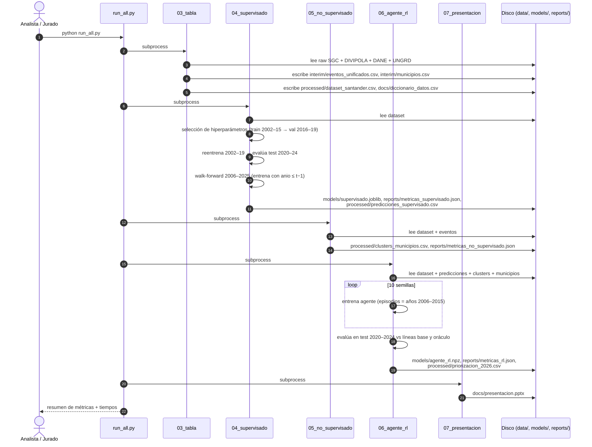
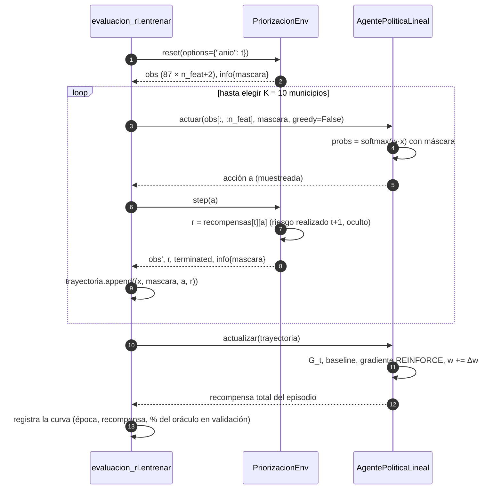
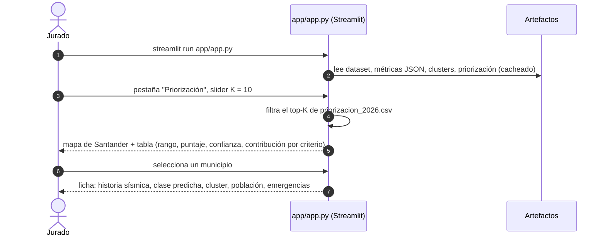

# 04 · Diagramas de secuencia

## 4.1 Pipeline completo (`python run_all.py`)

```mermaid
sequenceDiagram
    autonumber
    actor U as Analista / Jurado
    participant R as run_all.py
    participant T as 03_tabla
    participant S as 04_supervisado
    participant N as 05_no_supervisado
    participant L as 06_agente_rl
    participant P as 07_presentacion
    participant D as Disco (data/, models/, reports/)

    U->>R: python run_all.py
    R->>T: subprocess
    T->>D: lee raw SGC + DIVIPOLA + DANE + UNGRD
    T->>D: escribe interim/eventos_unificados.csv, interim/municipios.csv
    T->>D: escribe processed/dataset_santander.csv, docs/diccionario_datos.csv
    R->>S: subprocess
    S->>D: lee dataset
    S->>S: selección de hiperparámetros (train 2002–15 → val 2016–19)
    S->>S: reentrena 2002–19 → evalúa test 2020–24
    S->>S: walk-forward 2006–2025 (entrena con anio ≤ t−1)
    S->>D: models/supervisado.joblib, reports/metricas_supervisado.json,<br/>processed/predicciones_supervisado.csv
    R->>N: subprocess
    N->>D: lee dataset + eventos
    N->>D: processed/clusters_municipios.csv, reports/metricas_no_supervisado.json
    R->>L: subprocess
    L->>D: lee dataset + predicciones + clusters + municipios
    loop 10 semillas
        L->>L: entrena agente (episodios = años 2006–2015)
    end
    L->>L: evalúa en test 2020–2024 vs líneas base y oráculo
    L->>D: models/agente_rl.npz, reports/metricas_rl.json,<br/>processed/priorizacion_2026.csv
    R->>P: subprocess
    P->>D: docs/presentacion.pptx
    R-->>U: resumen de métricas + tiempos
```

## 4.2 Un episodio de entrenamiento del agente RL

```mermaid
sequenceDiagram
    autonumber
    participant E as evaluacion_rl.entrenar
    participant ENV as PriorizacionEnv
    participant AG as AgentePoliticaLineal

    E->>ENV: reset(options={"anio": t})
    ENV-->>E: obs (87 × n_feat+2), info{mascara}
    loop hasta elegir K = 10 municipios
        E->>AG: actuar(obs[:, :n_feat], mascara, greedy=False)
        AG->>AG: probs = softmax(w·x) con máscara
        AG-->>E: acción a (muestreada)
        E->>ENV: step(a)
        ENV->>ENV: r = recompensas[t][a]  (riesgo realizado t+1, oculto)
        ENV-->>E: obs', r, terminated, info{mascara}
        E->>E: trayectoria.append((x, mascara, a, r))
    end
    E->>AG: actualizar(trayectoria)
    AG->>AG: G_t, baseline, gradiente REINFORCE, w += Δw
    AG-->>E: recompensa total del episodio
    E->>E: registra la curva (época, recompensa, % del oráculo en validación)
```

## 4.3 Uso de la demo (jurado / tomador de decisiones)

```mermaid
sequenceDiagram
    autonumber
    actor J as Jurado
    participant A as app/app.py (Streamlit)
    participant D as Artefactos

    J->>A: streamlit run app/app.py
    A->>D: lee dataset, métricas JSON, clusters, priorización (cacheado)
    J->>A: pestaña "Priorización", slider K = 10
    A->>A: filtra el top-K de priorizacion_2026.csv
    A-->>J: mapa de Santander + tabla (rango, puntaje, confianza, contribución por criterio)
    J->>A: selecciona un municipio
    A-->>J: ficha: historia sísmica, clase predicha, cluster, población, emergencias
```
